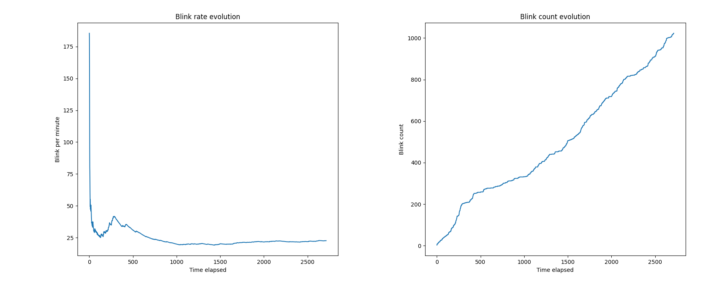

# Eyestrain Tracer

## Introduction
I have been suffering from eyestrain since 2019, at first only when I was in front of a screen for a long time, but today things are worse. 

With this experience and some curiosity, I want to understand how my body work. Eyestrain is well documented and I read a lot about.  

Following informations and theories will be documented as good as I can, since I am not a Doctor, a Specialist or a Scientific.
I hope that my work can give me some complementary data about my eyes health.

I can be wrong *de but en blanc*, but anyways it will be a way to learn OpenCV and to understand statistics. 

## Goal to achieve
I want to get enough data about my eyes during my work on the computer to understand what can make my eyestrain appear. So that I can prevent it.

Theses metrics will be compared to average metrics and analysed so that I can find if I doesn't blink enough, or, if I blink enough maybe that will put ligth on another problem, like bad quality tears.

## Informations about eyes

### What is our mean blink rate per minute?
From [this article](https://www.ncbi.nlm.nih.gov/pmc/articles/PMC6118863/)
> The mean ± standard deviation blink rate was 19.74 ± 9.12/min at baseline. The blink rate decreased significantly under both reading conditions (to 11.35 ± 10.20 and 14.93 ± 10.90/min when reading from a book and a tablet, respectively).  

But from the research ["Analysis of blink rate patterns in normal subjects"](https://movementdisorders.onlinelibrary.wiley.com/doi/10.1002/mds.870120629)
> Mean BR at rest was **17 blinks/min**, during conversation it increased to 26, and it was as low as **4.5 while reading**.

Can we notice that in normal conditions human blink their eyes around 18 times per minute?

## Observations about the Blink tracker
The calculation of the blink rate becomes more accurate over time (Left graph).

In my case, with the actual blink tracker, I get a final measure of 22.6 blinks/min.
## Credits
I used [this post of Stepan Filonov](https://medium.com/@stepanfilonov/tracking-your-eyes-with-python-3952e66194a6) as base to start the project.